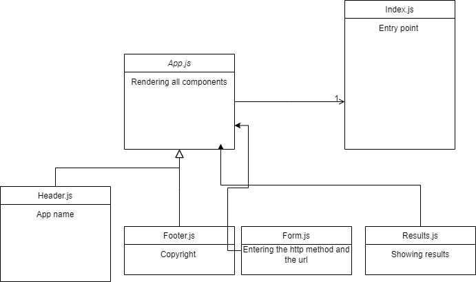

# RESTy Application

## Pull Request
[pullRequest](https://github.com/JalalHasan-22/resty/pull/1)

In this app, we are trying to build a postman clone, making the basic http methods such as get, post, put and delete.

We have a text field where the user can enter the url and select the http method from radio buttons.

below you can check the uml diagram.

